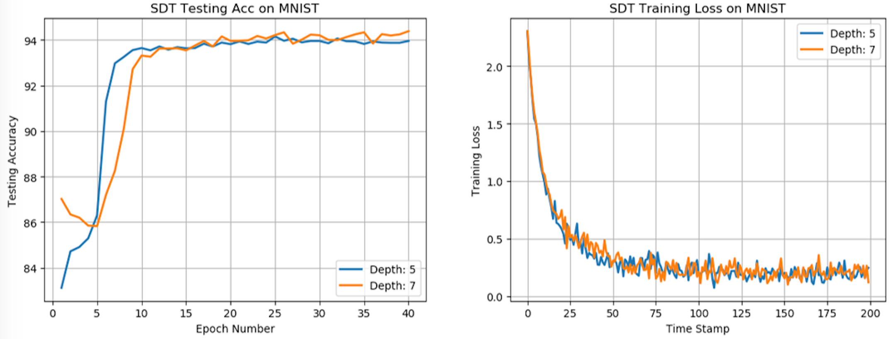

### Introduction 
This is the pytorch implementation on Soft Decision Tree (SDT), appearing in the paper "Distilling a Neural Network Into a Soft Decision Tree". 2017 (https://arxiv.org/abs/1711.09784).

### Quick Start 
Here I offer one demo on MNIST. To run the demo, simply type the following command:
``` 
python main.py 
``` 

### Introduction
Please see `main.py` for details on how to use SDT. For personal use, one need to change following variables:

- `use_cuda`: Actually, using CPU can be faster because you know......it's a tree
- `learner_args`: Parameters on SDT model, optimizer, etc.
- `data_dir`, `train_loader`, `test_loader`

Furthermore, main arguments in `learner_args` are:

- `depth`: tree depth (root node is with depth 0)
- `lamda`: regularization coefficient defined in equation (5) from raw paper, which decayes exponentially with the depth
- `lr`, `weight_decay`: learning rate, weight decay in optimizer

If you are interested in implementations on SDT, please see `SDT.py` for details. Instead of formally defining the structure of inner node and leaf node, I directly use one linear layer with sigmoid activation to simulate all inner nodes, for the sake of acceleration.

### MNIST Experiment Result
After training for 40 epochs with `batch_size` 128, the best testing accuracy using one SDT of depth **5**, **7** are **94.15** and **94.38**, separately (which is much close to the accuracy reported in raw paper). Related hyper-parameters are available in `learner_args`.

Better and more stable performance can be achieved by fine-tuning hyper-parameters. Below are the testing accuracy curve and training loss curve:



### Package Dependencies
SDT is developed in `python 3.6.5`. Following are the name and version of packages used in SDT: 

 - pytorch 0.4.1
 - torchvision 0.2.1
